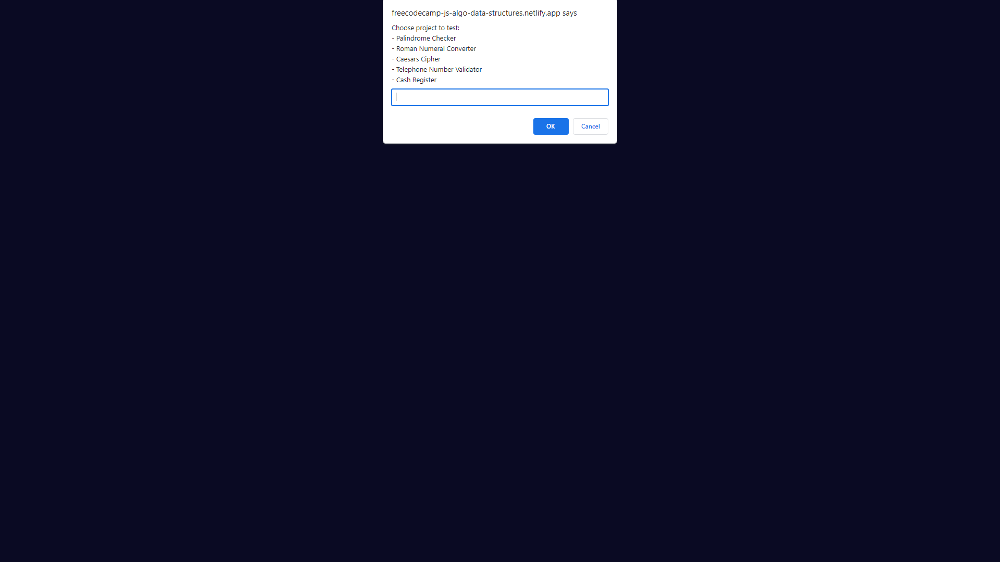

# freeCodeCamp - JavaScript Algorithms and Data Structures Certification

This is the website where I learned my first programming language which is JavaScript. I only use prompt to ask user what project they want to test and the output will be in the console through inspecting the browser.

## Here are the projects you can test:

- Palindrome Checker
- Roman Numeral Converter
- Caesars Cipher
- Telephone Number Validator
- Cash Register

## Certificate link:

- https://www.freecodecamp.org/certification/gerald_/javascript-algorithms-and-data-structures

## Demo link:

- https://freecodecamp-js-algo-data-structures.netlify.app/

